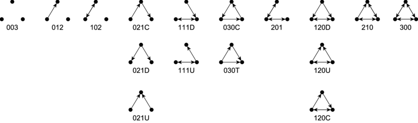

```{r setup, include=FALSE}
knitr::opts_chunk$set(echo = FALSE, warning = FALSE, message = FALSE, results = 'hide')
suppressPackageStartupMessages(library(igraph))
suppressPackageStartupMessages(library(tidygraph))
suppressPackageStartupMessages(library(tidyverse))
suppressPackageStartupMessages(library(knitr))
suppressPackageStartupMessages(library(ggraph))
suppressPackageStartupMessages(library(flextable))
suppressPackageStartupMessages(library(lakit))
suppressPackageStartupMessages(library(bb.fm.tools))


# Defining parameters
TRIALS <- 500 # number of random graphs generated to calculate expected values of parameters
```

<style type="text/css">

body{ /* Normal  */
      font-size: 12px;
  }
td {  /* Table  */
  font-size: 8px;
}
h1.title {
  font-size: 38px;
  color: DarkRed;
}
h1 { /* Header 1 */
  font-size: 28px;
  color: DarkBlue;
}
h2 { /* Header 2 */
    font-size: 22px;
  color: DarkBlue;
}
h3 { /* Header 3 */
  font-size: 18px;
  font-family: "Times New Roman", Times, serif;
  color: DarkBlue;
}
code.r{ /* Code block */
    font-size: 12px;
}
pre { /* Code block - determines code spacing between lines */
    font-size: 14px;
}
</style>

``` {r analysis_functions}
# Graph analysis
analyse_graph <- function(g, trials = TRIALS) {
  n <- length(V(g)) # number of nodes
  d <- edge_density(g)
  t <- transitivity(g)
  # Note - use 'betweenness' for centrality; number of shortest paths through a node. Seems most appropriate for this type of network 
  c <- centralization.betweenness(g)$centralization
  apl <- average.path.length(g)
  # triad census and comparison see - https://www.markanthonyhoffman.com/social_network_analysis/measuring-transitivity-and-structural-balance.html
  # Academic paper - https://arxiv.org/abs/1502.07016 
  Mutual_Asymmetric_Null_classes <-   c("003",  "012",  "102",  "021D",
                     "021U", "021C", "111D", "111U",
                     "030T", "030C", "201",  "120D",
                     "120U", "120C", "210",  "300")
  triads <- triad_census(g)
  trial_triads <- vector("list", length = trials)
  trial_transitivity <- c()
  trial_centralization <- c()
  trial_apl <- c()
  for (i in 1:trials) {
    rg <- erdos.renyi.game(n, d, directed = T)
    trial_triads[[i]] <- triad_census(rg)
    trial_transitivity[[i]] <- transitivity(rg)
    trial_centralization[[i]] <- centralization.betweenness(rg)$centralization
    trial_apl[[i]] <- average.path.length(rg)
  }
  expected_triads <- Reduce("+", trial_triads) / trials
  expected_transitivity <- mean(trial_transitivity)
  expected_centralization <- mean(trial_centralization)
  expected_apl <- mean(trial_apl)
  triad_df <- tibble(MAN_class = Mutual_Asymmetric_Null_classes,
                     Triads = triads,
                     expected = expected_triads)
  return(list(Nodes = n, Desnsity = d, 
              `Transitivity` = t, `Expected Transitivity` = expected_transitivity,
              `Centralization` = c, `Expected Centralization` = expected_centralization,
              `Average Path Length` = apl, `Expected APL` = expected_apl,
              `Triad Census` = triad_df))
}

plot_graph <- function(g, layout = "kk", 
                       remove_iso = F, identify_nodes = F, no_legend = T) {
  if (remove_iso) {
    g <- g %>% 
      activate(nodes) %>% 
      filter(!node_is_isolated())
  }
  p <- g %>% 
    ggraph(layout = layout) +
    geom_node_point(alpha = 0.8) +
    geom_edge_fan(aes(alpha = hits), 
                  show.legend = F, 
                  arrow = arrow(angle = 12, 
                                length = unit(0.3, "cm"), 
                                type = "closed")) +
    theme_graph() +
    theme(text = element_text(family = "TT Times New Roman"))
  if (identify_nodes) {
    p <- p + geom_node_text(aes(label = person), alpha = 0.7, size = 3)
  }
  if (no_legend) {
    p <- p + theme(legend.position = "none")
  }
  return(p)
}
```

``` {r reading_data}
fm.dat <- read_csv(file = file.path('~', 'Data', 'ad hoc', 'fm MGT330 for sduan.csv'))
subjects <- unique(fm.dat$subject)
```

Exploring comparisons between the forum networks of  `r subjects`, using techniques common to Social Network Analysis (SNA) for education[^1]. Of particular interest is examining triadic closure and strong / weak ties in the network. 

# Understanding the results

In the tabular results for each forum network below, there are a few concepts worth outlining.

## Overall structure and definitions

**Nodes** : The nodes (or vertices) in the network are the people involved in the forum. The total number (recorded as _nodes_ below) is just the number of students enrolled plus any academics that participated in the forum. Students in the course that did not post in the forum are included.

**Edges** : The edges in the network represent 'interactions' between students on the forum. So if Student A replies to a forum post of Student B, then this is represented by connecting those two students with an edge (line). These edges are directed; Student A replying to a post of Student B connects $A \rightarrow B$. Note that an edge in this context is a collection of forum posts (and the associated text data) between two people.

**Density** : How 'full' the network is, calculated as the ratio of edges in the graph to the total number of possible edges.

**Average Path Length** : A _path_ in this context is a series of forum-connected students, and this is the average length of this paths. It is sometimes called the _degree of separation_ or the _characteristic path length_, and along with centralisation is a key measure in graph-level summary statistics[^2].

**Transitivity** : Sometimes called the _clustering coefficient_ this measures the probability that adjacent vertices of a vertex are connected. In the context of the forum; if Student A has interacted directly on the forum with Student B *and* Student C this is the probability that Student B and Student C.

**Edge betweenness** : A measure of the 'strength' of an edge, by finding approximately how many shortest paths pass through that particular edge.  

**Centralisation** : As calculated here this uses the *betweenness* metric defined above, and aggregates the betweenness

## Triads

Studying each subset of possible 3-node subgraphs in the network has been shown to be effective in analysing affiliation networks[^5][^3]. 

### Mutual-Asymmetric-Null Triadic Classes

The Mutual-Asymmetric-Null encoding system classifies triad connections in a _directed graph_. The three numbers represent, in order, the number of (M)utual edges, the number of (A)symmetric edges, and the number of (N)ull or no edges between nodes. The possible connections (and their names) are outlined below:



### Triad Census

The _Triad Census_ classifies all 3-node subsets according to the Mutual-Asymmetric-Null class above, and is compared to the expected number of those triads for a random graph of the same number of nodes and density. 

## Expected values

All these measures are useful, but hard to know what to compare them to. One way around this is to compare them to random graphs with similar properties[^2][^4]. So for each analysed network `r TRIALS` random graphs were generated using the same number of nodes and density. The random graphs are generated using the _Erdos-Renyi_ method[^6], and then the results averaged to generate an approximate expected value of each given metric.  

# Social Network Analysis

``` {r build_graphs}
nested.df <- fm.dat %>% 
    group_by(subject) %>% 
    nest() %>% 
    mutate(graph = data %>% map(~as.igraph(make_fm_graph(.)))) %>% 
    mutate(analysis = graph %>% map(analyse_graph))
```

## Full forum network

Note that this currently does not display students enrolled in the course but not participating in the forum. Isolated points indicate people that posted a question but did not recieve a reply.

``` {r forum_network}
map2(.x = nested.df$graph,
     .y = nested.df$subject, 
     function(x, y){plot_graph(x) + ggtitle(y)})
```

## Triadic Census

``` {r traidic_census, results = "asis"}
map2(.x = nested.df$analysis,
     .y = nested.df$subject, 
     .f = function(x, y){
         kable(as.data.frame(x[1:8]), caption = y)
     })
map2(.x = nested.df$analysis,
     .y = nested.df$subject, 
     .f = function(x, y){
         kable(x$`Triad Census`, digits = 0, caption = y)
     })
```


``` {r edge_strength}
# Need to add stuff using edge.betweenness function for finding strong paths,

# then look at using the tidytext package for sentiment analysis, etc
```

# References

[^1]: Grunspan, Wiggins & Goodreau (2017). *Understanding Classrooms through Social Network Analysis: A Primer for Social Network Analysis in Education Research* https://www.lifescied.org/doi/10.1187/cbe.13-08-0162

[^2]: D. Watts & S. Strogatz (1998). *Collective dynamics of ‘small-world’ networks* http://dx.doi.org/10.1038/30918

[^3]: Brunson (2016). *Triadic analysis of affiliation networks* https://arxiv.org/pdf/1502.07016.pdf

[^4]: Bearman & Hoffman (2017). *Social Network Analysis* https://www.markanthonyhoffman.com/social_network_analysis/index.html

[^5]: Davis, J.A. and Leinhardt, S. (1972). *The Structure of Positive Interpersonal Relations in Small Groups.* In J. Berger (Ed.), Sociological Theories in Progress, Volume 2, 218-251. Boston: Houghton Mifflin.

[^6]: Erdos, P. and Renyi, A., (1959). *On random graphs, Publicationes Mathematicae 6*, 290–297.

[^7]: Need to find reference that supports what I think is right here.

``` {r other_links, eval = F}
# https://www.cs.cornell.edu/home/kleinber/networks-book/networks-book-ch03.pdf
# 
# https://www.cs.cornell.edu/home/kleinber/networks-book/networks-book-ch04.pdf 
# 
# 
# https://stats.stackexchange.com/questions/35763/finding-weak-ties-in-network-data - r function for 

```

